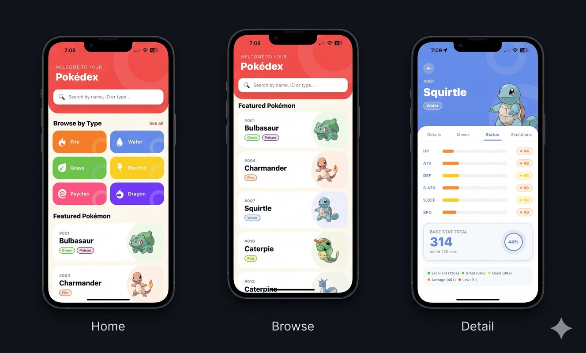

# 🦖 Pokédex Mobile Application



<div align="center">
  
  [](https://expo.dev)
  [](https://reactnative.dev)
  [](https://www.typescriptlang.org)
  [](https://opensource.org/licenses/MIT)

</div>

---

## 📖 Project Overview

This is a premium, high-performance, and professionally designed **Pokédex Mobile Application** built with **React Native**, **Expo SDK 54**, and **Expo Router**. Optimized for both **iOS** and **Android**, it delivers a seamless user experience using cache-first data fetching and beautiful, micro-animated interfaces.

The app runs exclusively in <span style="color:#F59E0B;font-weight:bold">Light Mode</span>, featuring a warm cream background (`#FEF9F0`) and Pokédex Red (`#EF5350`) branding accents. 

---

## ✨ Core Features

*   🔍 **Unified Smart Search:** Instantly search Pokémon by name, national ID (`25` or `#025`), or elemental type. If a Pokémon is not in the cached list, the search bar queries the PokéAPI directly to retrieve details.
*   🏷️ **Elemental Type Categories:** Browse a beautifully organized rectangular grid of elemental type categories complete with custom-colored cards, matching SVG type icons, and decorative background accents.
*   ⭐ **Type-Diverse Featured Section:** View a list of featured Pokémon generated dynamically from initial fetches ensuring representation of diverse elemental types (no hardcoded IDs).
*   📊 **Professional Status Dashboard:** Interactive stat bars powered by `react-native-reanimated` with color-coded tier dots and concentric total-stats progress rings showing the absolute rating out of a maximum value of 720.
*   🧬 **Evolution Chain Traversal:** Displays the full evolution hierarchy showing evolution requirements (triggers like levels or stones) along with high-res thumbnails.
*   ⚔️ **Comprehensive Learnset Profiles:** Detailed tab listing learnable moves including elemental type alignment, power metrics (PWR), and PP levels.

---

## 🛠️ Tech Stack & Architecture

### 📁 Project Structure

```text
learnexpo/
├── 📂 app/                  # File-system routes (Expo Router)
│   ├── _layout.tsx          # App entry stack navigator configuration
│   ├── index.tsx            # Home dashboard screen
│   ├── types.tsx            # Grid display of all 18 types
│   ├── pokemon/
│   │   └── [id].tsx         # Tabbed Pokémon profiles screen
│   └── type/
│       └── [type].tsx       # Pokemon list filtered by type
├── 📂 components/           # Shared presentation elements
│   ├── PokemonCard.tsx      # Standardized Grid/List item
│   ├── SearchBar.tsx        # Text filter input with clear controls
│   ├── StatBar.tsx          # Reanimated progress indicator
│   └── TypeBadge.tsx        # Styled elemental pill badges
├── 📂 constants/            # Design guidelines & global constants
│   ├── typeColors.ts        # Color hex codes and gradients per type
│   └── featuredIds.ts       # Visual parameters and emojis
├── 📂 hooks/                # Data fetching and hook handlers
│   ├── usePokemon.ts        # List fetching & page caching
│   └── usePokemonDetail.ts  # Complex multi-endpoint details builder
└── 📂 assets/               # Graphical assets (Mockups, SVG type icons)
```

---

## ⚡ Performance Optimizations

1.  💾 **Module-Level Map Caching:** Custom hooks use static `Map` instances to cache fetched data. Navigating back and forth between screens loads data instantly without triggering additional API hits.
2.  🖼️ **Fast Image Loading:** Uses `expo-image` for high-performance memory-mapped image caching. Leverages high-res official artwork with dynamic transition fades and immediate fallback sprite placeholders.
3.  📦 **Virtualization & Layout Limits:** Search lists and category cards use highly-optimized FlatLists. Sub-pages limit lists and tables to a maximum of 60 items to keep render trees thin.
4.  🎨 **GPU Animated Stats:** Reanimated drivers animate progress bars on the native thread to ensure 60fps animations.

---

## 🚀 Getting Started

### Prerequisites

Make sure you have Node.js and npm installed on your computer.

### Installation

1.  **Clone the project:**
    ```bash
    git clone <repository-url>
    cd learnexpo
    ```

2.  **Install dependencies:**
    ```bash
    npm install
    ```

3.  **Start the Expo Packager:**
    ```bash
    npm run start
    ```

4.  **Run on devices:**
    - Press **`i`** to start on the iOS Simulator (requires Xcode).
    - Press **`a`** to start on the Android Emulator (requires Android Studio).
    - Scan the QR code with the **Expo Go** application on your physical device.
